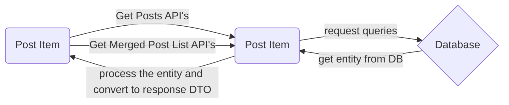

# socialmedia

### Implemented with Spring Boot and Postgres DB
### Application Graph


### Postgres DB docker setup 

First of all, Docker should be installed to get the project up and running. 
> Docker can be installed from [here](https://docs.docker.com/desktop/mac/install/)
* After the project is downloaded, follow the steps below :
```bash  
docker pull postgres
docker run --name social -e POSTGRES_PASSWORD=admin -d -p 5432:5432 postgres
docker exec -it social psql -U postgres
```  

### Postman

Postman collections added to the project folder.
